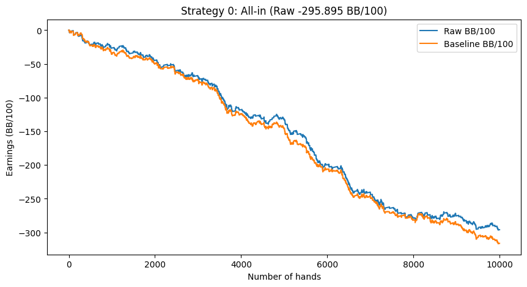
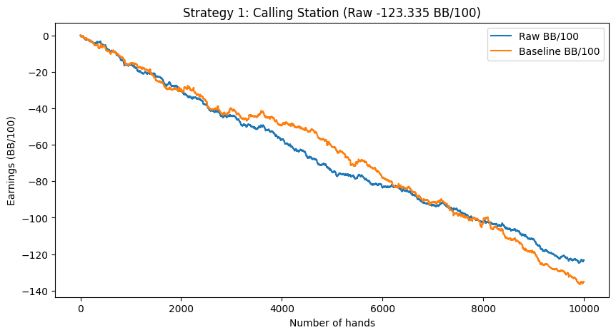

# Poker-AI
I developed an AI agent from scratch to play Heads-Up (i.e. 2 players) No-Limit Texas Hold'Em Poker, solved using Counterfactual Regret Minimization (CFR). Implements card and bet abstraction by computing equity distributions and clustering using K-Means Clustering.

Resources
- Rules for limit hold'em are explained [here](https://www.pokerlistings.com/limit-texas-holdem)
- [Resources](resources.md) for useful links
- Links also available in my notes https://stevengong.co/notes/Poker-AI


## Installation
Running the Poker AI is super straightforward.

(*Recommended, but not required*) Create a virtual environment with Conda to not pollute your Python workspace:
```bash
conda create -n poker-ai python=3.9
```

Then, install the Python libraries
```bash
pip install -r requirements.txt
```

## Usage
Play against the AI through a GUI:
```bash
cd game
python3 poker_main.py
```

Training:
To reduce the complexity of the game tree, I solve separately for pre-flop and post-flop (flop, turn, river). This is done by limiting the possible betting rounds in each secenario.

The pre-flop training is done by running
```bash
python3 preflop_holdem.py
```

The post-flop training is done by running
```bash
cd src
python3 postflop_holdem.py
```

## Discussions

### Why Poker AI is interesting
Poker is an interesting game to work on because it is an imperfect information game. This means that unlike perfect-information games such as Chess, in Poker, there is this uncertainty about the opponent's hand, which allows really interesting plays like Bluffing.

### Things left to implement
- [ ] Implement sub-game solving to come up with better strategies during the actual game (search in imperfect information games)
- [ ] Implement depth-limited solving to improve the strategy in real-time
- [ ] Implement Computer Vision + Deep Learning to recognize Poker cards, and so you can deploy this model in real life by mounting a camera to your head


### Timeline
06-06-2022: Created a basic Poker Environment in PyGame to play in. Wrote classes for `Card`, `Deck`, `Player`, `PokerEnvironment`. Used bitmasks to quickly evaluate the strength of a hand.
07-01-2022: Started learning about writing the AI. Explored different reinforcement learning algorithms, look into what papers have done. Realized that RL algorithms don't work at all in imperfect information games. It fails at the simplest game of Rock-Paper-Scissors because the policy it comes up with is deterministic, and easily exploitable. What we need to do is take a game theory approach, using the idea of Counterfactual Regret Minimization (CFR) to create a strategy that converges to the Nash Equilibrium.
07-05-2022: Implementd regret-matching for Rock-Paper-Scissors
07-15-2022: Wrote the vanilla CFR code for Kuhn Poker
09-07-2022: Implemented abstractions to reduce the size of the Poker game to solve for. Implemented a simple clustering algorithm that uses these EHS to cluster various cards / scenarios together. Implemented basic monte-carlo method to calculate the EHS of a pair of cards at different stages of the game. This assumes a random uniform draw of opponent hands and random uniform rollout of community cards.
09-20-2022: Used this project as a personal poker trainer (displaying the pot odds). Can help you refine your game, see the `learn_pot_odds.py` file.
09-30: Write CFR code as a library, since there is no universal support of CFR. I wish the researchers released those, but everyone seems to just do their own thing. It kind of seems like the early days of neural networks, when everyone would write their own backward pass for backpropagation, until Tensorflow and Pytorch came along.
06-15-2024: Started revisiting the project. Used simple equity to cluster, since computing equity distribution is too slow, my compute not beefy enough.
06-17-2024: Split into preflop training and post-flop training. Started training over 1,000,000 different hands, with dataset generated in `src/dataset`.

### Dataset
I generated 1,000,000 hands of poker data offline, which I used to train the AI. The dataset is stored in `src/dataset` (each file contains 50,000 hands). The clusters are also pregenerated, with 10 clusters per stage, where the EHS is used. See `src/abstraction.py` for how the dataset is generated.

## Benchmarking
Poker has very high variance, which also makes it hard to benchmark. I've benchmarked against the [Slumbot](https://www.slumbot.com/), which was one of the best poker bots in the world in 2017. Measured across ~10,000 hands. API code in [slumbot_api.py](slumbot/slumbot_api.py). Visualizations generated from the [visualize.ipynb](slumbot/visualize.ipynb) notebook.

First 3 strategies implement logic purely on heuristics.

#### Strategy 0: Always checking or calling the opponent's bet (-142.325 BB/100)
This is the most naive implementation, where we always check or call the opponent's bet. We never fold.


```python
if a["last_bettor"] == -1:  # no one has bet yet
    incr = "k"
else:  # opponent has bet, so simply call
    incr = "c"
```




#### Strategy 1: Naive bet by equity (-77.36 BB/100)
```python
equity = calculate_equity(hole_cards, board, n=5000)
print(f"equity calculated: {equity} for hole cards: {hole_cards} and board: {board}")
if a["last_bettor"] == -1:
    if equity >= 0.5:
        incr = "b1000"
    else:
        incr = "k"
else:
    if equity >= 0.5:
        incr = "c"
    else:
        incr = "f"
```



#### Strategy 2: More advanced equity
A more advanced heuristics that makes bets based on the current equity (see `slumbot/slumbot_api.py`).

I actually played this "AI" against my dad and it had beaten him :P

#### Strategy 3: use CFR
CFR on very abstracted version of the game. Preflop and flop solved independently.


## Important Files
- `poker_main.py` contains code for the GUI interface to the Poker game
- `environment.py` contains the game logic
- `aiplayer.py` contains logic to interface with AI
- `postflop_holdem.py` contains the logic for training Poker AI for **postflop**
- `preflop_hodlem.py` contains logic for trainining Poker AI for **preflop**


## High-Level overview of AI
The main idea of the Poker algorithm is storing a strategy profile for "every possible scenario" to maximize our reward at all stages of a poker round.
- A "Strategy profile" means defining how the AI should behave. For example, if you had pocket aces on the pre-flop, and you are the big blind, a strategy profile might tell you that you should make a pot-size raise 50% of the time, and go all-in the other 50% of the time.

However, Poker No-Limit Hold'Em is an extremely large game. This means we would have to store $10^{161}$ sets of strategy profiles. That is simply not feasible.

Hence, we first group similar scenarios together (this is called game abstraction). We thus solve a smaller game that is computationally tractable.

After we've created an abstract version of the game that is smaller, we solve it directly using an algorithm called Counterfactual Regret Minimization (CFR).


### Step 1: Game Abstraction
There are two common types of abstraction:
1. information (i.e. cards) abstraction
2. action (i.e. bet size) abstraction

For action abstraction, you size the bets according to how much money is currently being put into the pot. You can see this logic in the training.

Card Abstractions are done by grouping hands with similar equity distributions into the same bucket/cluster/node. Equity is a measure of expected hand strength, which is your probability of winning given a uniform random rollout of community cards and random opponent private cards.The idea is based from this [paper](https://www.cs.cmu.edu/~sandholm/potential-aware_imperfect-recall.aaai14.pdf), which talks about potential-aware and distribution aware card abstractions. In this project, cards are bucketed in 169 clusters (pre-flop), TBD (flop), TBD (turn), and TBD (river).


Slumbot abstractions:
https://nanopdf.com/queue/slumbot-nl-solving-large-games-with-counterfactual_pdf?queue_id=-1&x=1670505293&z=OTkuMjA5LjUyLjEzOA==

### Step 2: Generate a Blueprint Strategy with CFR
Counterfactual Regret Minimization ([CFR](http://modelai.gettysburg.edu/2013/cfr/cfr.pdf)) is a self-play algorithm used to learn a strategy to a game by repeatedly playing a game and updating its strategy to improve how much it "regret" taking a decision at a each decision point. This strategy has been wildly successful for imperfect information games like poker.

CFR has been shown to converge to Nash Equilibrium strategy for 2 player zero-sum games.

### Step 3: Run in real-time
In real-time, we abstract away the current game, and feed compute the blueprint strategy (full game -> abstracted game). Then, we take the action from the blueprint strategy, and convert it back to the real game bet size.
